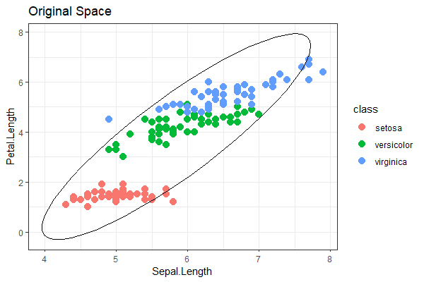
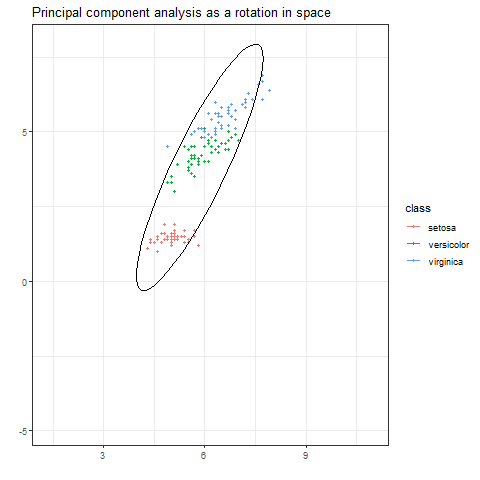

 
## Primcipal component analysis


```{r}
library(tidyverse)
data("iris")

X <- iris %>% 
  select(Sepal.Length,Petal.Length) %>%
  as.matrix()
```

Calculate the covariance matrix and the corresponding 
eigenvalue decomposition

```{r}
S <- cov(X)

res <- eigen(S)
lambda <- res$values
U <- res$vectors
```

```{r}
# Find the angle of rotation
theta <- acos(U[1,1])  
```


Set up a sequence of angles to rotate the space
Note that I have padded out the first and last $N=360$
to be the same to delay the animation at the beginning and
the end.

```{r}
N <- 360
theta_vec <- c(rep(0,N),seq(0,theta,,N),rep(theta,N))
```

Creat a sequence of datasets, one for each angle of roation
inn the `theta_vec` vector.

```{r}
dat1 <- c()

for (i in 1:(3*N)) {
  theta_i <- theta_vec[i]
  
  # Create the roation matrix
  R <- matrix(c(cos(theta_i),sin(theta_i),-sin(theta_i),cos(theta_i)),2,2)
  
  # Rotate the data matrix
  Z <- X%*%R
  
  # Store the results
  dat_i <- cbind(Z,theta_i,i,iris$Species)
  dat1 <- rbind(dat1,dat_i)  
}

colnames(dat1) <- c("pcomp1","pcomp2","theta","frame","class")
```

Turn the data into a tibble.

```{r}
tib1 <- as.tibble(dat1)
tib2 <- as.tibble(dat2)

recode <- c(setosa = 1, versicolor = 2, virginica=3)

tib1$class <- factor(tib1$class,
                     levels=recode,
                     labels=names(recode))
```

Create the plot for the first frame.

```{r}
# Change all themes to bw for plotting once
library(lattice)
theme_set(theme_bw())

library(ggforce) # for ellipses

g1 <- tib1 %>%
  filter(frame==1) %>%
  ggplot(aes(x=pcomp1,y=pcomp2, color=class)) +
  geom_point(size=3) +
  stat_ellipse(aes(x=pcomp1,y=pcomp2),inherit.aes = FALSE) +
  ggtitle("Original Space") +
  xlab("Sepal.Length") + ylab("Petal.Length") 

g1
ggsave("orig_plot.png", width = 6, height = 4, dpi=100)
```

Create the plot for the last frame.

```{r}
g3 <- tib1 %>%
  filter(frame==(3*N)) %>%
  ggplot(aes(x=pcomp1,y=pcomp2, color=class)) +
  geom_point(size=3) +
  stat_ellipse(aes(x=pcomp1,y=pcomp2),inherit.aes = FALSE) + 
  ggtitle("Principal component space") +
  xlab("PC1") + ylab("PC2")

g3
ggsave("pc_plot.png", width = 6, height = 4, dpi=100)
```

<center> 
 

</center>

```{r}
library(gganimate)

g2 <- tib1 %>%
  ggplot(aes(x=pcomp1,y=pcomp2, group=frame, color=class)) +
  geom_point(size=1) +
  stat_ellipse() + 
  ggtitle("Principal component analysis as a rotation in space") +
  xlab("") + ylab("") +
  transition_manual(frame)
  
g2 
anim_save("anim1.gif", width = 600, height = 400, end_pause=200)
```

<center> 

</center>

