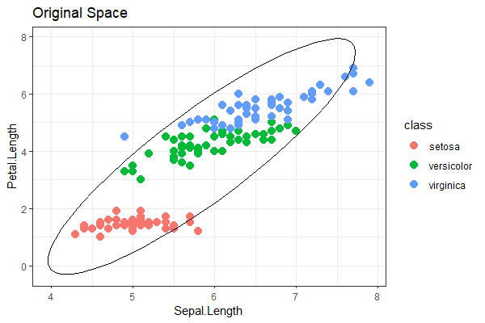
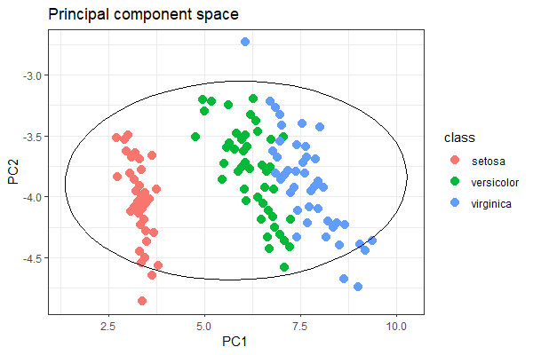
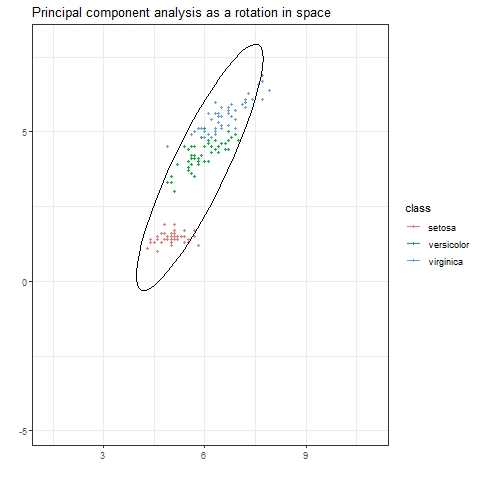

## Principal component analysis
 
The $i$th sample ${\bf x}_i$ gets transformed to principal component space via the transformation

$$y_{i1}=u_{11}x_{i1}+u_{21}x_{i2}+\dots+u_{p1}x_{ip}$$

and the elements $u_{11},u_{21},\dots,u_{p1}$ are referred to the loadings of the
first PC.

The loading vector ${\bf u}_1=[u_{11},u_{21},\dots,u_{p1}]^T$
defines direction in feature space along which data vary most, i.e.,

$$\mbox{Var}(Y_1) = {\bf u}^T{\boldsymbol\Sigma}{\bf u}$$

is maximized subject to ${\bf u}^T{\bf u}=1$. Successive principal
components similarly maximize variances subject to the constraint that
all principal components are orthogonal with unit length.

 
**Definition:** The $j$th _sample principle component_ is
given by

$${\bf Y}_j={\bf X}{\bf u}_j, \qquad j=1,\ldots,p$$
where ${\bf Y}_j =[y_{1j},\ldots,y_{nj}]$, $\widehat{\boldsymbol\Sigma} = {\bf U}{\boldsymbol\Lambda}{\bf U}^T$ is the eigendecomposition
of $\widehat{\boldsymbol\Sigma}$.

The set of all sample pricipal components is given by:

$${\bf Y} = {\bf X}{\bf U}$$
where the first PC corresponds to the first column of ${\bf Y}$,
the second PC corresponds to the second column of ${\bf Y}$ and so on.
Also,

$$\mbox{Cov}({\bf Y}) = \mbox{diag}(\lambda_1,\ldots,\lambda_p)$$


Let's suppose that we are dealing with $p=2$ dimensions.
In this case the eigenvector matrix must be of the form

$${\bf U} = \left[\begin{array}{rr} \cos(\theta) & -\sin(\theta) \\ \sin(\theta) & \cos(\theta) \end{array} \right]$$
Note that

$${\bf U}^T{\bf U} = 
\left[\begin{array}{rr} \cos(\theta) & \sin(\theta) \\ -\sin(\theta) & \cos(\theta) \end{array} \right]
\left[\begin{array}{rr} \cos(\theta) & -\sin(\theta) \\ \sin(\theta) & \cos(\theta) \end{array} \right] = 
\left[\begin{array}{rr} \cos(\theta)^2 + \sin(\theta)^2 & 0 \\ 0 & \cos(\theta)^2 + \sin(\theta)^2 \end{array} \right] = {\bf I}$$
So we have ${\bf u}_1^T{\bf u}_1 = {\bf u}_2^T{\bf u}_2 = 1$ and ${\bf u}_1^T{\bf u}_2=0$ by construction.


If we have 

$${\bf U} = \left[\begin{array}{rr} \cos(\theta) & -\sin(\theta) \\ \sin(\theta) & \cos(\theta) \end{array} \right]$$

and we want to maximize with respect to $\theta$

\begin{align}
\displaystyle \max_{\theta} \mbox{Var}(Y_1) 
& \displaystyle = \max_{\theta} \quad \frac{{\bf u}_1^T\widehat{\boldsymbol\Sigma}{\bf u}_1}{{\bf u}_1^T{\bf u}_1}
\\
& \displaystyle = \max_{\theta} \quad {\bf u}_1^T\widehat{\boldsymbol\Sigma}{\bf u}_1
\\
& = \lambda_1
\end{align}

This gives us a value of $\theta$. Then ${\bf u}_2 = [-\sin(\theta),\cos(\theta)]$
and $\lambda_2 = {\bf u}_2^T\widehat{\boldsymbol\Sigma}{\bf u}_2$.

 

In higher dimensional spaces, e.g., $p=3$ dimensions we can do the same thing with the three rotation matrices:

\begin{align}
R_x(\theta_x) 
&= \left[\begin{array}{ccc} 1 & 0 & 0 \\ 0 & \cos\theta_x &  -\sin \theta_x \\ 0 & \sin\theta_x &  \cos \theta_x \end{array}\right] \\ 
R_y(\theta_y) 
&= \left[\begin{array}{ccc} \cos \theta_y & 0 & \sin \theta_y \\ 0 & 1 & 0 \\ -\sin \theta_y & 0 & \cos \theta_y \end{array}\right] \\ 
R_z(\theta_z) 
&= \left[\begin{array}{ccc} \cos \theta_z &  -\sin \theta_z & 0 \\ \sin \theta_z &   \cos \theta_z & 0 \\ 0 & 0 & 1\end{array}\right]
\end{align}

which are called Jacobi rotation matrices. We can iteratively
calculate the angles and apply rotations that maximize the variances
in order to find all principal components.


## The animation code

```{r}
library(tidyverse)
data("iris")

X <- iris %>% 
  select(Sepal.Length,Petal.Length) %>%
  as.matrix()
```

Calculate the covariance matrix and the corresponding 
eigenvalue decomposition

```{r}
S <- cov(X)

res <- eigen(S)
lambda <- res$values
U <- res$vectors
```

```{r}
# Find the angle of rotation
theta <- acos(U[1,1])  
```


Set up a sequence of angles to rotate the space
Note that I have padded out the first and last $N=360$
to be the same to delay the animation at the beginning and
the end.

```{r}
N <- 360
theta_vec <- c(rep(0,N),seq(0,theta,,N),rep(theta,N))
```

Creat a sequence of datasets, one for each angle of roation
inn the `theta_vec` vector.

```{r}
dat1 <- c()

for (i in 1:(3*N)) {
  theta_i <- theta_vec[i]
  
  # Create the roation matrix
  R <- matrix(c(cos(theta_i),sin(theta_i),-sin(theta_i),cos(theta_i)),2,2)
  
  # Rotate the data matrix
  Z <- X%*%R
  
  # Store the results
  dat_i <- cbind(Z,theta_i,i,iris$Species)
  dat1 <- rbind(dat1,dat_i)  
}

colnames(dat1) <- c("pcomp1","pcomp2","theta","frame","class")
```

Turn the data into a tibble.

```{r}
tib1 <- as.tibble(dat1)
tib2 <- as.tibble(dat2)

recode <- c(setosa = 1, versicolor = 2, virginica=3)

tib1$class <- factor(tib1$class,
                     levels=recode,
                     labels=names(recode))
```

Create the plot for the first frame.

```{r}
# Change all themes to bw for plotting once
library(lattice)
theme_set(theme_bw())

library(ggforce) # for ellipses

g1 <- tib1 %>%
  filter(frame==1) %>%
  ggplot(aes(x=pcomp1,y=pcomp2, color=class)) +
  geom_point(size=3) +
  stat_ellipse(aes(x=pcomp1,y=pcomp2),inherit.aes = FALSE) +
  ggtitle("Original Space") +
  xlab("Sepal.Length") + ylab("Petal.Length") 

g1
ggsave("orig_plot.png", width = 6, height = 4, dpi=100)
```

Create the plot for the last frame.

```{r}
g3 <- tib1 %>%
  filter(frame==(3*N)) %>%
  ggplot(aes(x=pcomp1,y=pcomp2, color=class)) +
  geom_point(size=3) +
  stat_ellipse(aes(x=pcomp1,y=pcomp2),inherit.aes = FALSE) + 
  ggtitle("Principal component space") +
  xlab("PC1") + ylab("PC2")

g3
ggsave("pc_plot.png", width = 6, height = 4, dpi=100)
```

<center> 
 

</center>

```{r}
library(gganimate)

g2 <- tib1 %>%
  ggplot(aes(x=pcomp1,y=pcomp2, group=frame, color=class)) +
  geom_point(size=1) +
  stat_ellipse() + 
  ggtitle("Principal component analysis as a rotation in space") +
  xlab("") + ylab("") +
  transition_manual(frame)
  
g2 
anim_save("anim1.gif", width = 600, height = 400, end_pause=200)
```

<center> 

</center>

